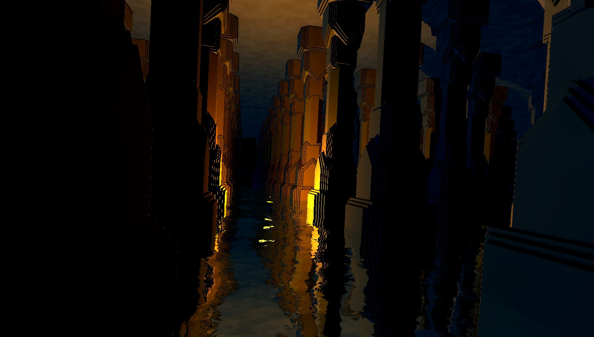
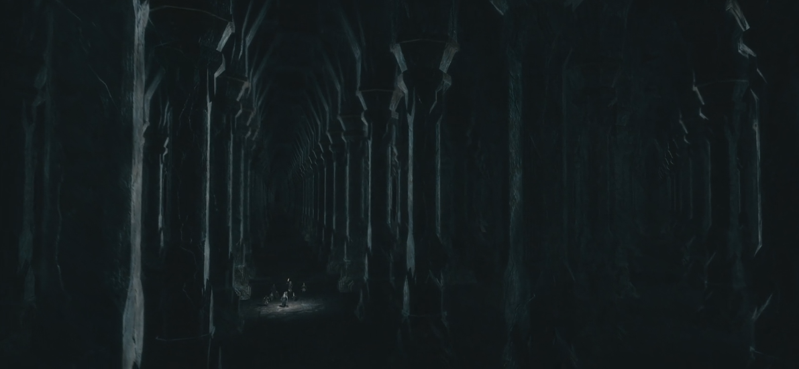

# CIS 566 Homework 3: Environment Setpiece
#### Name and pennkey : lan lou

## Flooded moria

[demo](https://lanlou123.github.io/hw03-environment-setpiece/)

## inspiration :
mines of moria from lord of the rings series, different from the original scene, I created water and made a boat to traverse between the gigantic dwarf pillars


## Features:
- animation of the water and boat(with lantern as a dynamic light source)
  - water generation: water is gerated based on a composition of sin and cos functions, together with exponetial part of some of the result, it's kind of like
  foureir transform, but way simpler, thus more efficient, in general, we will begin with the number of current iteration, generate a vec2 through ```vec2(sin(iter),cos(iter))```
  then use the vector to get two component for next iteration : first component(just like what we did in a FBM which generally have a gradually decreasing octave number) 
  of vec2 will be used for the weight of next iteration, second component dictates the speed the evaluation point will be travelling along the current direction, which
  as mentioned before is(vec2(sin(iter),cos(iter))).
  - ray marching for water: to aquire accurate water geometry, we will use different method to the normal raymarching, instead of evaluating  value of a sdf 
  and increasing or decreasing t value correspondinglly, we need to evaluate the value```heightfield value - watersurface```, and change t based on this, the other operations will
  remain the same.
- FBM noise used as a source for generating the ceiling of the hall, some perlin noise are used to further randomrize the water,
- two other directional light aside from the dynamic light on the boat
- SDF-based soft shadows (based on IQ's penumbra shadow)
- Ambient occlusion
- distance fog based on the distance of fragment position to light position,(the fog is black as I was trying to create the dark atmosphere in the original refernece)
- Ray based reflection : the reflection is generated using two procedures, for the first half, I begin by getting the ray's intersecting point with the water's 
surface, by cauculating water's normal at that point and using glsl's reflect function,I get the reflected direction, the second half,I used the intersecting point as 
new origin, and reflect direction as ray direction, input this ray into the geometry pass's render function, and finally get the correct reflected color.
notice that the rflected result is able to track the movement of shadow on the pillar, since there are two seperate render pass.
- domain repetition: geometry of the pillar is created as follows :
 - first generate two long boxes streching in the y dimension, make one of them rotate 45 degree, and then get intersect of the two to create a octagonal pillar base shape,
 - next I used several Hexagonal Prism - exact(from IQ) to get repetetive decorations at the bottom,
 - then use the same sdf of the decoration at the bottom, copy another one, scale it down, move upwards.
 - mirror the entire geometry
 - use domain repetition throung moding the xz value of current point
 
 ## References:
 - IQ soft penumbra shaow, and sdf funtions
